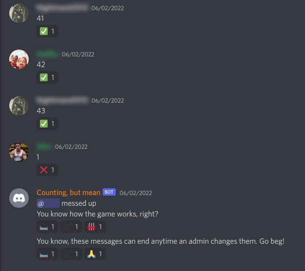

# Counting Royale
Discord counting with punishments

## Table of contents
* [General info](#general-info)
* [Technologies](#technologies)
* [Setup](#setup)
* [Commands](#commands)

## General Info
Every played discord counting? Ever wished to ban everyone who messed you up? This does just that, along with many other customizable punishments. Messages can be customized in ```config.yml``` if, for some reason, the bot's snarky personality isn't to your liking.

 \
*Reactions are optional*

## Technologies
This project is created with:
* [Flask](https://github.com/Rapptz/discord.py): 1.1.2
* [Discord Interactions](https://github.com/goverfl0w/discord-interactions): 3.0.1
* [PyYaml](https://pyyaml.org/): 5.1b1
* [Number Parser](https://github.com/scrapinghub/number-parser): 0.2.1

## Setup
Clone the Repo \
```git clone https://github.com/Pop101/CountingRoyale``` \
Enter the Repo and Install requirements \
```cd CountingRoyale && sudo python3 -m pip install -r requirements``` \
Insert your token in ```config.yml``` \
Run the app! \
```sudo python3 bot.py```

## Commands
The bot uses slash commands with a base command of ```/counting``` \
```/counting list```: \
&emsp;&emsp; Lists all of the server's counting channels or its settings
```/counting statistics```: \
&emsp;&emsp; Lists a user's strength at counting. If no arguement is given, displays your statis instead
```/counting settings view```: \
&emsp;&emsp; Views any or all of the server's settings
#### Admin-Only
```/counting toggle```: \
&emsp;&emsp; Enables counting in this channel. Requires manage server or administrator
```/counting settings adjust```: \
&emsp;&emsp; Adjusts a server's settings. Requires manage server or administrator


